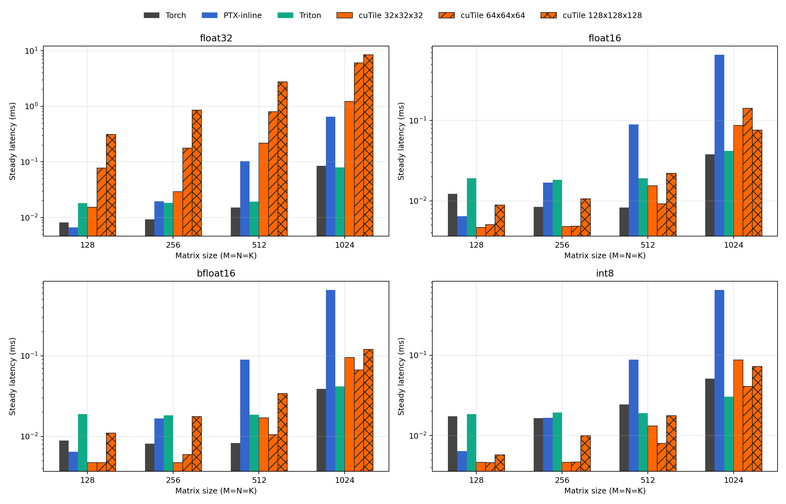
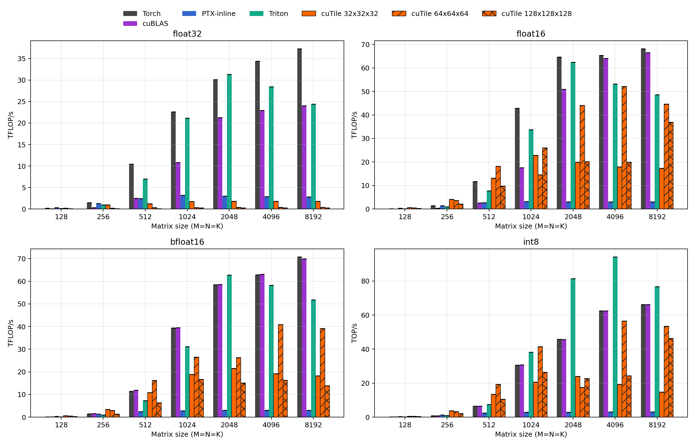
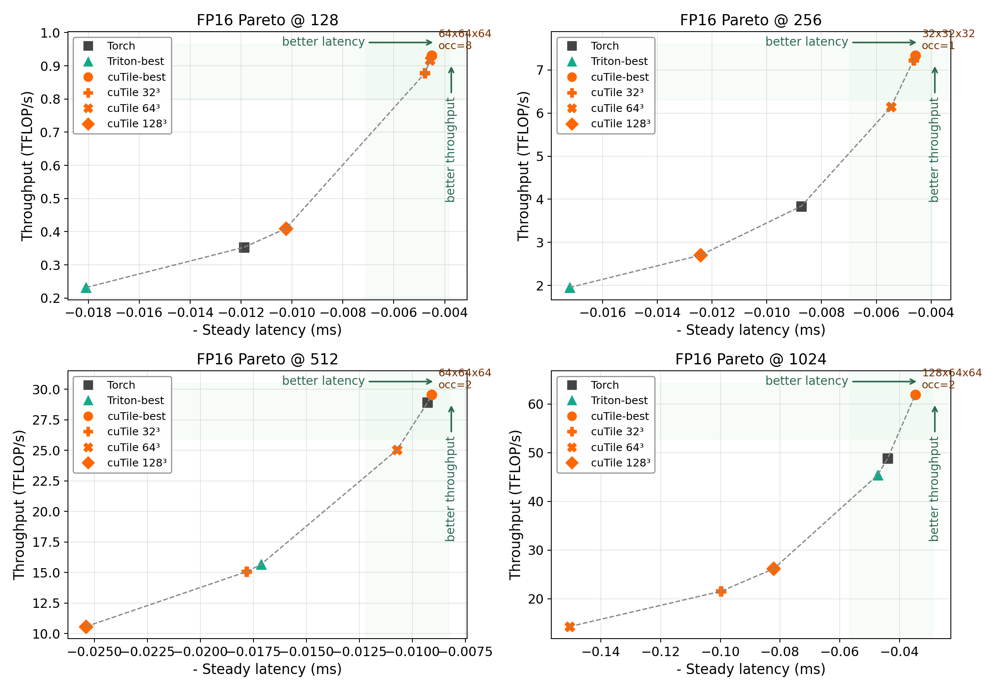
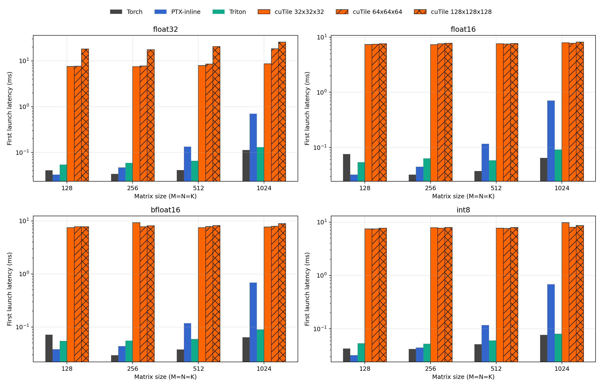
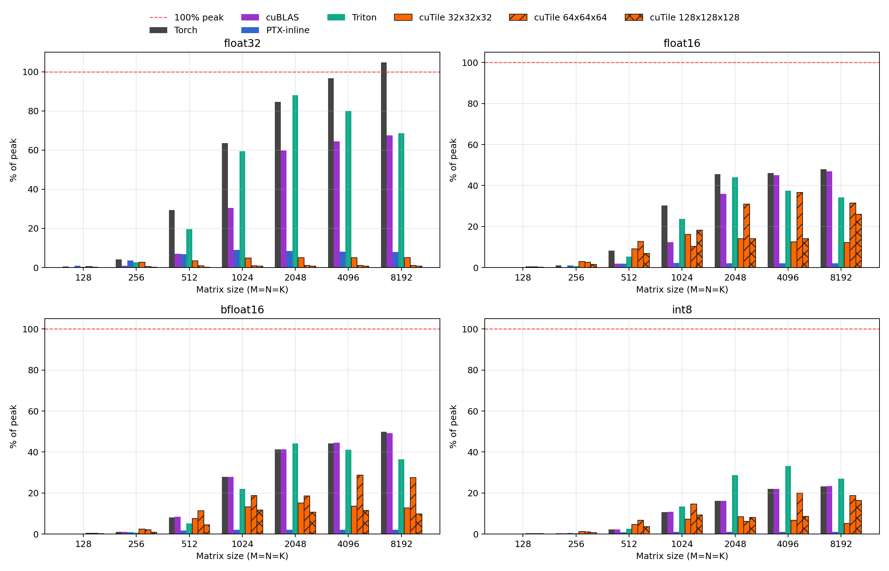
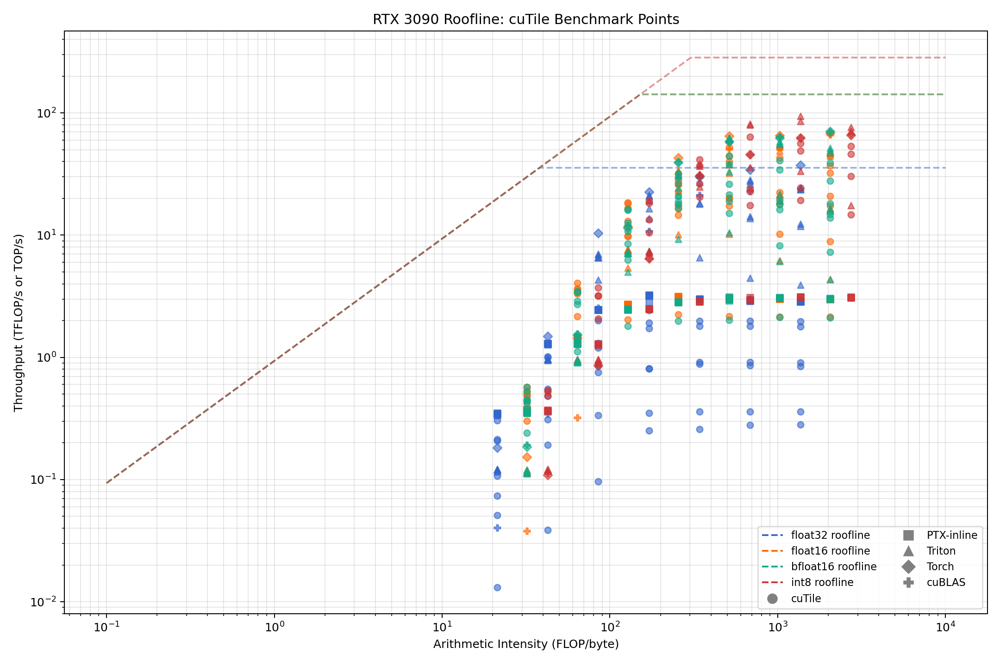

# cuTile RTX 3090 Benchmark Results

## Summary

| Backend | Dtype | Best Size | TFLOP/s | Latency (ms) | % Peak |
|---------|-------|-----------|---------|---------------|--------|
| cuTile (128x64x64) | float16 | 1024 | 61.93 | 0.035 | 43.6% |
| cuTile (64x64x64) | bfloat16 | 1024 | 56.07 | 0.038 | 39.5% |
| cuTile (64x64x16) | float32 | 1024 | 8.12 | 0.264 | 22.8% |
| Torch | float16 | 1024 | 58.82 | 0.037 | 41.4% |
| Triton | float16 | 1024 | 49.13 | 0.044 | 34.6% |
| PTX-inline (16x16) | float16 | 1024 | 4.31 | 0.498 | 3.0% |

*Values from RTX 3090, 82 SMs. Peak: FP16/BF16 142 TFLOP/s, FP32 35.6 TFLOP/s, INT8 284 TOP/s.*

## Key Findings

- cuTile is latency- and throughput-competitive with Torch and Triton on FP16/BF16 when tile shapes are tuned.
- Tile choice is the dominant control knob: the best tile changes with problem size (32x32x32 at 256, 64x64x64 at 512, 128x64x64 at 1024).
- Cold-start compile cost (10-50 ms for cuTile/Triton) is real and must be separated from steady-state measurement.
- The int8 path does not preserve exact int32 GEMM semantics; see [int8 investigation](investigations/int8_ir/).

## Figures

*Steady-state latency across backends and dtypes (log scale).*

*Throughput confirms FP16/BF16 competitiveness.*

*Latency-vs-throughput Pareto: cuTile enters the useful frontier on RTX 3090.*

*Cold-start overhead separated from steady-state.*

*Achieved throughput as percentage of RTX 3090 theoretical peak.*

*Roofline analysis: all benchmark points vs. RTX 3090 memory/compute ceilings.*

## Int8 Caveat

The cuTile int8 path accumulates through a narrowed int8 intermediate rather than exact int32 GEMM semantics (`max_err_exact = 768`, `max_err_tile_wrapped_i8 = 0`). Int8 throughput numbers are diagnostic only. See [investigations/int8_ir/](investigations/int8_ir/) for IR evidence.

## Cold-Start

Compile and first-launch costs are measured separately with host wall time. For FP16 1024x1024x1024: cuTile compile ~22 ms, first launch ~0.8 ms, steady-state ~0.035 ms.

## Methodology and Raw Data

- Methodology: [docs/methodology.md](docs/methodology.md)
- Tile selection analysis: [docs/cutile_tile_selection_rtx3090.md](docs/cutile_tile_selection_rtx3090.md)
- Raw data: [artifacts/full/benchmark_raw.csv](artifacts/full/benchmark_raw.csv), [artifacts/full/benchmark_raw.json](artifacts/full/benchmark_raw.json)
- Best-of-sweep: [artifacts/full/benchmark_best.csv](artifacts/full/benchmark_best.csv)
- FP16 focus: [artifacts/fp16_focus/fp16_raw.csv](artifacts/fp16_focus/fp16_raw.csv)
- System info: [artifacts/system/benchmark_system.json](artifacts/system/benchmark_system.json)
