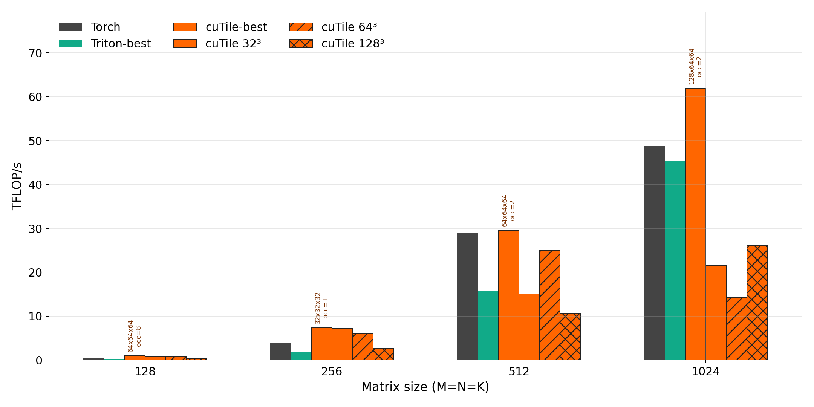
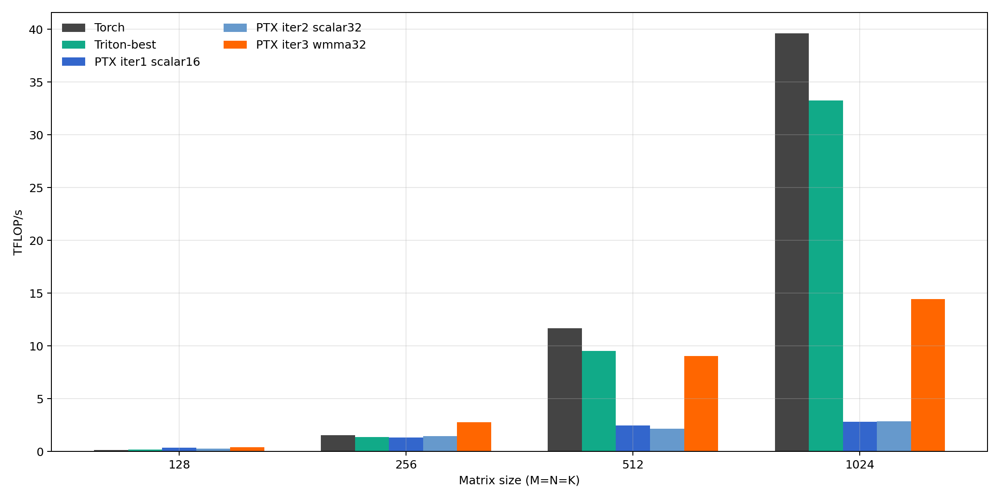

# cuTile on RTX 3090: Fast Enough to Matter, Not Clean Enough to Ship

cuTile is more interesting than a toy, but not yet clean enough to call production-ready. That is the real result of this benchmark.

On an RTX 3090, cuTile can be latency- and throughput-competitive with Triton and Torch on half-precision floating-point (FP16) and brain floating point (BF16) once the tile shape is tuned to the problem. That makes it worth taking seriously as a compiler and kernel-generation path on Ampere. But the same artifact set also shows exactly why benchmark screenshots are not enough: cold-start cost is real, the Parallel Thread Execution (PTX) baseline still explains a large part of the performance gap, and the current int8 path fails exact general matrix multiplication (GEMM) semantics.

This repo is therefore not a victory lap. It is a measured engineering story:

- cuTile has a real FP16/BF16 performance case on Ampere.
- PTX compile and first-launch cost must be separated from steady-state runtime.
- readable PTX is useful for learning, but it is not a substitute for a production kernel stack.
- int8 currently disqualifies broader correctness claims.

## Why This Benchmark Matters

Most small benchmark repos make one of two mistakes. They either compare a highly tuned path against a weak baseline and overclaim, or they bury the interesting part of the result under too much methodology. This benchmark tries to avoid both.

The question is narrow: on a GeForce RTX 3090, can cuTile become competitive enough on practical square GEMMs to deserve further investment?

That question matters because Ampere is still a very common deployment and development target. If cuTile can get into the same performance conversation as Triton and Torch on Ampere for FP16/BF16, the stack is worth taking seriously. If it cannot, then the story is mostly academic.

The answer is: it can, but only with careful tuning, and only if you are honest about everything else the stack still gets wrong.

## The Headline Result

The strongest story in the data is not float32 and it is not int8. It is tuned low-latency FP16/BF16 on Ampere.

From the current artifact set:

- fastest observed `float16` latency: `0.005 ms` on cuTile at size `128`
- fastest observed `bfloat16` latency: `0.005 ms` on cuTile at size `128`
- fastest observed `float32` latency: `0.006 ms` on PTX-inline at size `128`
- fastest observed `int8` latency: `0.005 ms` on cuTile at size `128`, but the semantics are not valid for exact int32 GEMM

That already tells you how to read the rest of the post. cuTile is not the universally best backend. It is a backend that can land in the competitive set for the right workload class and the right tile choices.

## Latency Is the First Figure That Matters

If the benchmark is meant to say anything relevant to real inference and small-batch workloads, the low-size latency regime matters more than a giant throughput chart by itself.

*Figure 1. The latency view is the cleanest high-level proof that tuned cuTile belongs in the conversation on Ampere FP16/BF16. Small sizes matter here because they are where kernel overhead and scheduling decisions dominate.*

The important read is not “cuTile wins everywhere.” It does not. The important read is that cuTile does not collapse into irrelevance once the problem becomes latency-sensitive. For a compiler-oriented kernel path, that is a serious result.

## Throughput Confirms That the Latency Result Is Not a Fluke

Latency alone can be misleading. A backend can look fine at tiny shapes and then fall apart once the arithmetic starts to dominate. The throughput view is the second half of the proof.

*Figure 2. Throughput confirms the same core point: cuTile is not merely surviving small kernels, it can also sustain competitive FP16/BF16 performance when the tile is tuned correctly.*

This is the right way to summarize the throughput story:

- FP16 and BF16 are where cuTile becomes genuinely interesting.
- Float32 remains more of a baseline and methodology story.
- Int8 should not be interpreted as a throughput win because the semantics are not trustworthy.

## The Real FP16 Story Is About Tuning, Not Brand Names

The most honest way to present cuTile is not “cuTile vs Triton” in the abstract. It is “what happens when you let tile choice decide whether cuTile is merely plausible or actually strong?”

The focused FP16 sweep makes that obvious:

- size `128`: best cuTile = `64x64x64`, occupancy `8`, `0.93 TFLOP/s`, `0.005 ms`
- size `256`: best cuTile = `32x32x32`, occupancy `1`, `7.34 TFLOP/s`, `0.005 ms`
- size `512`: best cuTile = `64x64x64`, occupancy `2`, `29.57 TFLOP/s`, `0.009 ms`
- size `1024`: best cuTile = `128x64x64`, occupancy `2`, `61.93 TFLOP/s`, `0.035 ms`

*Figure 3. Once PTX is removed from the headline and the problem is reduced to FP16 competitiveness, the result becomes clearer: cuTile is highly sensitive to tile selection, but it can absolutely become competitive.*

The richer way to look at the same result is as a frontier problem, not a single winner-takes-all score:

*Figure 4. The FP16 Pareto view is the strongest evidence in the repo. It shows that the relevant question is not whether one backend “wins,” but whether cuTile can move onto the useful latency/throughput frontier at all. On RTX 3090, it can.*

That is the performance argument for taking cuTile seriously on Ampere. Not that it replaces Triton. Not that it dominates Torch. But that it enters the set of plausible optimized choices.

## Cold-Start Cost Is the Tax You Still Have to Pay

A lot of benchmark narratives quietly let compile and first-launch cost disappear into a steady-state average. That would make the result look better, but it would also make it less useful.

This repo reports cold-start separately because the distinction is operationally important:

*Figure 5. The cold-start plot is the reminder that runtime competitiveness does not erase compilation and first-launch overhead. If you care about short-lived processes, interactive workflows, or one-shot kernels, this cost matters.*

For the current PTX validation case at `float16 1024x1024x1024`, the benchmark records:

- compile time: `22.416 ms`
- first launch: `0.811 ms`
- steady-state latency: `0.752 ms`

That is not an implementation detail. It is part of the product story. A backend that looks excellent in steady-state but expensive at cold-start still has a deployment tax.

## PTX Is Useful Here, but Not for the Reason Many People Want

The PTX-inline baseline is useful in this repo because it explains something. It is not useful because it proves handwritten PTX is the right production answer.

The PTX iteration study shows exactly where that line is:

*Figure 6. The PTX iteration study is valuable because it shows how much of the gap is explained by obvious design steps: scalar tiling, larger tiles, then tensor-core entry. It also shows how far that still is from a fully engineered library path.*

The progression is intuitive:

1. scalar `16x16x16` is readable but leaves performance on the table
2. scalar `32x32x32` improves reuse and grid efficiency
3. WMMA enters the tensor-core path, but still lacks deeper scheduling and pipelining

So the PTX story in this repo is not “PTX beats everyone.” The story is that PTX gives a visible ladder of optimizations that makes the cuTile and Triton results easier to reason about.

## The Int8 Result Changes the Entire Interpretation

This is the most important caveat in the repo, and it belongs in the main story, not buried in a footnote.

The current cuTile int8 path does not preserve exact int32 GEMM accumulation semantics. The exported investigation shows:

- `max_err_exact = 768`
- `max_err_tile_wrapped_i8 = 0`

That means the current result matches a wrapped-per-tile accumulation model rather than exact int32 GEMM semantics.

The benchmark therefore supports a very specific conclusion:

- int8 data is useful diagnostically
- int8 data is not strong enough for a production performance claim

This is exactly the kind of result that a weaker benchmark would hide. This repo does the opposite: it makes the failure central to the interpretation of the whole artifact set.

## What This Benchmark Proves

- cuTile can be competitive on Ampere FP16/BF16 when tile shapes are tuned.
- Tile choice is the real control knob; backend labels alone are not the story.
- cold-start cost must be separated from steady-state runtime
- PTX baselines are useful for explanation and iteration analysis

## What This Benchmark Does Not Prove

- that cuTile is broadly production-ready
- that the current int8 path is valid for exact GEMM claims
- that the stack has a proven memory-footprint advantage
- that these results generalize beyond the tested RTX 3090 setup

Those boundaries matter. Without them, this would read like a benchmark advertisement. With them, it reads like a benchmark artifact.

## Benchmark Appendix

### System

- GPU: NVIDIA GeForce RTX 3090, 24 gigabytes (GB), compute capability `8.6`
- CPU: AMD Ryzen 7 5800X, `16` logical central processing unit (CPU) threads
- Driver: `580.126.20`
- NVIDIA reported Compute Unified Device Architecture (CUDA) version: `13.0`
- Torch CUDA version: `12.8`
- Python: `3.13.12`

Authoritative system artifact:

- [artifacts/system/benchmark_system.json](artifacts/system/benchmark_system.json)
- [artifacts/system/benchmark_system.md](artifacts/system/benchmark_system.md)

### Benchmark Configuration

- shapes: `128`, `256`, `512`, `1024` with `M=N=K`
- dtypes: `float32`, `float16`, `bfloat16`, `int8`
- full-sweep tile families:
  - `16x16x16`
  - `32x32x16`
  - `32x32x32`
  - `64x64x16`
  - `64x64x32`
  - `64x64x64`
  - `128x128x128`
- full report warmup / iterations: `3 / 20`
- PTX phase validation warmup / iterations: `5 / 50`

### Methodology

- steady-state timing uses CUDA events after warmup
- compile and first-launch timing use host wall time with explicit synchronization
- float references disable TensorFloat-32 (TF32) to keep the comparison stricter
- int8 is checked against both exact int32 accumulation and the wrapped-per-tile model observed in the exported intermediate representation (IR)

### Raw Data and Supporting Artifacts

- [artifacts/full/benchmark_raw.csv](artifacts/full/benchmark_raw.csv)
- [artifacts/full/benchmark_best.csv](artifacts/full/benchmark_best.csv)
- [artifacts/fp16_focus/fp16_raw.csv](artifacts/fp16_focus/fp16_raw.csv)
- [artifacts/ptx_iterations/ptx_iteration_raw.csv](artifacts/ptx_iterations/ptx_iteration_raw.csv)
- [artifacts/full/report_summary.md](artifacts/full/report_summary.md)
- [artifacts/fp16_focus/cutile_fp16_optimization_summary.md](artifacts/fp16_focus/cutile_fp16_optimization_summary.md)
- [artifacts/ptx_iterations/ptx_iteration_analysis.md](artifacts/ptx_iterations/ptx_iteration_analysis.md)
- [investigations/int8_ir/summary.json](investigations/int8_ir/summary.json)
- [investigations/int8_ir/mm_i8.cutileir.txt](investigations/int8_ir/mm_i8.cutileir.txt)
