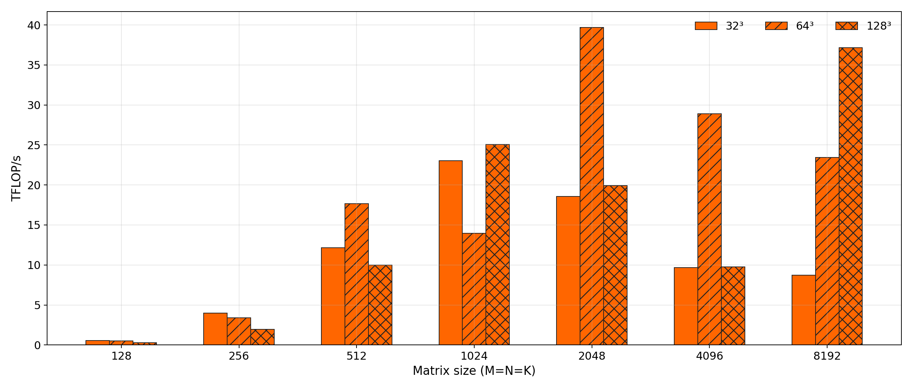
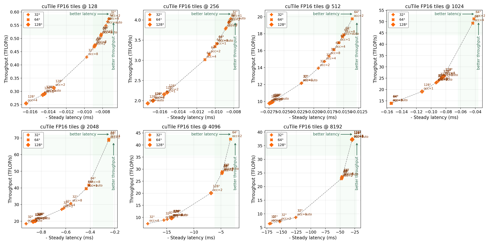
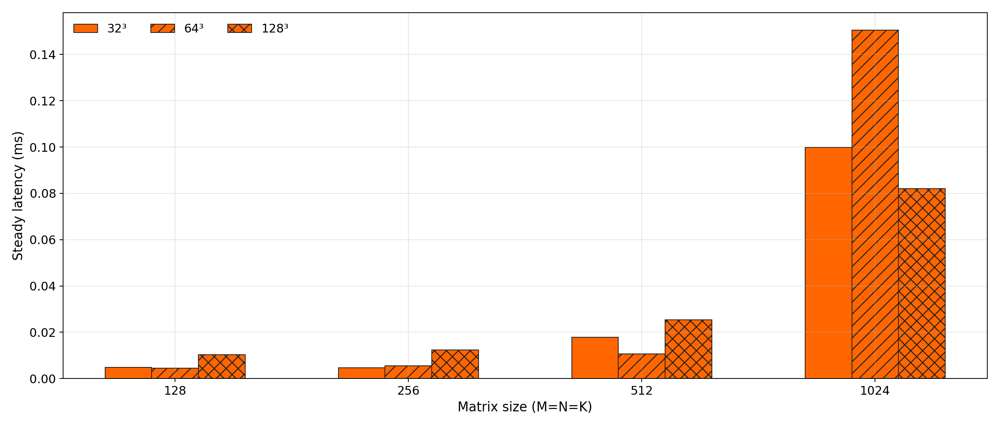
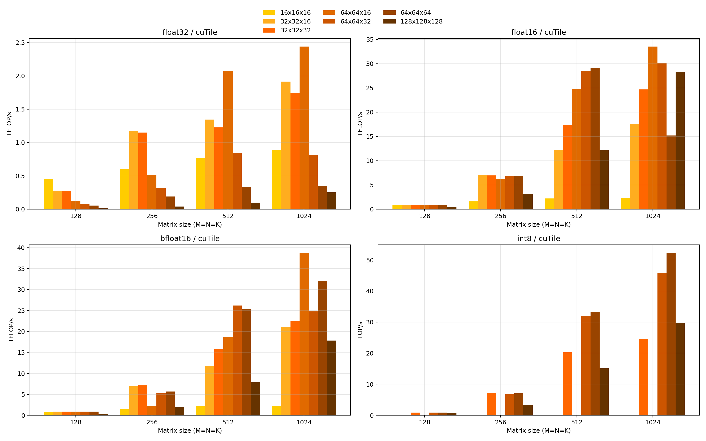

# Why `32x32x32` Wins at 256, `64x64x64` Wins at 512, and `128x64x64` Wins at 1024 on RTX 3090

cuTile does not have a single best tile. It has a best tile for a given workload scale, data type, and machine balance. On this RTX 3090 system, the data says exactly that.

The winning half-precision floating-point (FP16) configurations from the focused sweep are:

| Size | Best cuTile config | Occupancy hint | Steady latency | Throughput |
| --- | --- | --- | --- | --- |
| 128 | `64x64x64` | `8` | `0.0045 ms` | `0.93 TFLOP/s` |
| 256 | `32x32x32` | `1` | `0.0046 ms` | `7.34 TFLOP/s` |
| 512 | `64x64x64` | `2` | `0.0091 ms` | `29.57 TFLOP/s` |
| 1024 | `128x64x64` | `2` | `0.0347 ms` | `61.93 TFLOP/s` |

That progression is not random. It is the interaction of three forces:

1. Workload shape: how much arithmetic exists per launch.
2. Tile economics: how many cooperative thread arrays (CTAs) get launched and how many K-loop iterations each CTA must execute.
3. RTX 3090 system behavior: 82 streaming multiprocessors (SMs), Ampere-class Tensor Core-friendly FP16/BF16 execution, and a regime where kernel launch and scheduling overhead still matter at small sizes.

The rest of this post explains why these specific tiles emerge as the sweet spots.

## The Machine Context: What RTX 3090 Rewards

The benchmarked host is:

- GPU: NVIDIA GeForce RTX 3090 graphics processing unit (GPU)
- Compute capability: `8.6`
- SM count: `82`
- Video random-access memory (VRAM): `24 GB`
- Driver: `580.126.20`
- Torch CUDA version: `12.8`

From a tile-selection perspective, those facts imply:

- FP16 and BF16 can plausibly benefit from Tensor Core-friendly execution.
- A tile choice that produces only a handful of CTAs will leave most of the 82 SMs idle.
- A tile choice that creates too many tiny CTAs can spend too much time on scheduling, tile loads, and loop overhead.
- Very large tiles only pay off when the problem is large enough to amortize their per-CTA footprint.

In other words, RTX 3090 rewards tile shapes that are large enough to increase reuse, but not so large that they starve the grid or blow up per-CTA cost.

## The Workload Context: CTA Count and K-Loop Count

For square GEMMs with `M=N=K=size`, two derived quantities explain most of the behavior:

- CTA count: `(size / tile_m) * (size / tile_n)`
- K-tile count: `size / tile_k`

For the winning and near-winning FP16 families, those numbers look like this:

| Size | Tile | CTAs | K-tiles |
| --- | --- | --- | --- |
| 128 | `32x32x32` | `16` | `4` |
| 128 | `64x64x64` | `4` | `2` |
| 256 | `32x32x32` | `64` | `8` |
| 256 | `64x64x64` | `16` | `4` |
| 512 | `32x32x32` | `256` | `16` |
| 512 | `64x64x64` | `64` | `8` |
| 1024 | `64x64x64` | `256` | `16` |
| 1024 | `128x64x64` | `128` | `16` |
| 1024 | `128x128x64` | `64` | `16` |
| 1024 | `128x128x128` | `64` | `8` |

This is the core trade-off:

- Larger `tile_m/tile_n` reduces CTA count and increases per-CTA work.
- Larger `tile_k` reduces inner-loop count and improves reuse.
- But larger tiles also increase the per-CTA resource footprint, which can reduce effective occupancy and scheduling flexibility.

The winning tile at each size is the one that balances those three effects most effectively on this GPU.

## Figure 1: The FP16 Tile Sweep Shows a Size-Dependent Crossover

*Figure 1. The winning tile family changes with workload size. Small problems want lower overhead; medium and large problems increasingly reward reuse and lower K-loop count.*

The plot makes one thing obvious: tile choice is not a constant preference baked into cuTile. It is workload-dependent.

At small size, the best tiles are clustered tightly. At larger size, the ranking separates much more clearly, because the machine has enough arithmetic to expose whether the tile is really using the GPU efficiently.

## Why `64x64x64` Wins at Size 128

For `128x128x128`, the problem is so small that the benchmark is mostly about overhead discipline.

The top FP16 rows are extremely close:

- `64x64x64`, `occ=8`: `0.9309 TFLOP/s`, `0.00451 ms`
- `32x32x32`, `occ=1`: `0.9170 TFLOP/s`, `0.00457 ms`
- `64x64x32`, `occ=auto/2`: `0.9170 TFLOP/s`, `0.00457 ms`

That near-tie matters. It means the 128 result should not be over-romanticized. The real lesson is not that `64x64x64` is overwhelmingly superior. The lesson is that once the problem is this small:

- fewer K-tiles helps because the launch is too short to hide repeated inner-loop overhead
- a very large output tile can win because the problem is not large enough for CTA abundance to matter
- occupancy hints become second-order tuning knobs, not primary design levers

Why `64x64x64` edges out `32x32x32` anyway:

- `64x64x64` cuts K-tiles from `4` to `2`
- it reduces total CTAs from `16` to `4`
- for a tiny GEMM, that reduction in loop and scheduling overhead is enough to matter

On an 82-SM GPU, `4` CTAs is terrible for overall machine utilization. But for a 128-sized GEMM, machine utilization is not the limiting factor. Launch overhead and short-loop efficiency are.

So size 128 is fundamentally a latency microkernel problem, not a chip-saturation problem.

## Why `32x32x32` Wins at Size 256

The `256` case is the first interesting transition point.

The best rows are:

- `32x32x32`, `occ=1`: `7.336 TFLOP/s`, `0.00457 ms`
- `64x64x64`, `occ=2`: `6.222 TFLOP/s`, `0.00539 ms`
- `64x64x32`, `occ=1`: `5.994 TFLOP/s`, `0.00560 ms`

This is where larger tiles stop being “obviously better.”

Why `32x32x32` wins:

- It produces `64` CTAs, which is finally close enough to the 82-SM scale of the GPU to distribute work broadly.
- Its per-CTA footprint is smaller, so the kernel can keep the tile machinery lighter.
- It keeps `tile_k=32`, which is still a reasonable K-loop count at this size.

Why `64x64x64` loses here despite better reuse:

- It drops the grid to just `16` CTAs.
- That is not enough work to spread well across the device.
- The larger tile footprint does not pay back enough because the entire GEMM is still small.

This is the classic medium-small GEMM regime: the kernel needs enough parallel work to keep the GPU busy, but the problem is still not large enough to fully amortize a heavyweight CTA.

## Why `64x64x64` Wins at Size 512

At `512`, the center of gravity changes.

The best rows are:

- `64x64x64`, `occ=2`: `29.565 TFLOP/s`, `0.00908 ms`
- `64x64x32`, `occ=4`: `25.206 TFLOP/s`, `0.01065 ms`
- `32x32x32`, `occ=8`: `20.805 TFLOP/s`, `0.01290 ms`

Now `64x64x64` is not barely winning. It is clearly winning.

Why:

- `64x64x64` still launches `64` CTAs, which is enough to cover most of the 82 SMs.
- It cuts the K-loop count in half relative to `32x32x32` (`8` vs `16`).
- The problem is finally large enough that the extra reuse from a bigger tile amortizes its larger per-CTA cost.

This is the cleanest “tile crossover” in the dataset. At 256, `64x64x64` is too heavy for the amount of work. At 512, it is finally large enough to be worth it.

That is exactly what you would expect on a large Ampere GPU: the best tile grows once the workload becomes substantial enough to pay for bigger local working sets.

## Why `128x64x64` Wins at Size 1024

This is the most informative case in the entire sweep.

At `1024`, the top FP16 rows are:

- `128x64x64`, `occ=2`: `61.93 TFLOP/s`, `0.03468 ms`
- `64x128x64`, `occ=2`: `58.15 TFLOP/s`, `0.03693 ms`
- `64x128x32`, `occ=2`: `56.38 TFLOP/s`, `0.03809 ms`
- `64x64x64`, `occ=2`: `56.07 TFLOP/s`, `0.03830 ms`
- `128x128x64`, `occ=4/8`: `37.90 TFLOP/s`, `0.05666 ms`
- `128x128x128`, `occ=1/8`: `26.35 TFLOP/s`, `0.08151 ms`

The key point is not just that larger tiles help. It is that **asymmetric larger tiles** help, while the biggest symmetric tiles overreach.

Why `128x64x64` wins:

- It halves one grid dimension relative to `64x64x64`, so each CTA does more output work.
- It keeps `tile_k=64`, so the K-loop count stays at `16` instead of jumping to `32`.
- It still launches `128` CTAs, which is enough parallel work to keep an 82-SM GPU busy.
- It grows reuse and arithmetic intensity without collapsing the grid.

Why `128x128x64` and `128x128x128` lose:

- They shrink the grid to only `64` CTAs.
- They make each CTA substantially heavier.
- The additional reuse is not enough to compensate for the loss in scheduling flexibility and the increased per-CTA resource pressure.

Why `64x64x64` loses to `128x64x64`:

- It still has more CTAs (`256`), but at this size the workload is already large enough that CTA abundance is no longer the main problem.
- The kernel benefits more from bigger output tiles and fewer “small tile” boundary/control costs than from the extra grid granularity.

This is the signature of a mature workload-size transition: once the problem is large enough, the best tile is no longer the one that maximizes CTA count, but the one that maximizes useful work per CTA without starving the machine.

## Figure 2: The FP16 Pareto View Shows Why “Bigger” Is Not the Rule

*Figure 2. The best configurations are not “the biggest tiles possible.” They are the tiles that move onto the useful latency-throughput frontier for this specific GPU and problem size.*

The failure of `128x128x64` and `128x128x128` at size 1024 is the most important anti-folklore result in the post. Bigger tiles do not automatically mean better performance. The win comes from balancing:

- enough reuse to make Tensor Core-friendly math efficient
- enough CTAs to cover 82 SMs
- a CTA footprint small enough that the kernel still schedules cleanly

That is why `128x64x64` wins. It increases useful work per CTA without overcommitting the CTA.

## The Occupancy Hint Is a Tuning Knob, Not a Monotonic Good

The winning occupancy hints are:

- size `128`: `occ=8`
- size `256`: `occ=1`
- size `512`: `occ=2`
- size `1024`: `occ=2`

That pattern is a warning against simplistic “more occupancy is always better” thinking.

The data suggests:

- For tiny kernels, high occupancy hints can help shave a few microseconds when the whole problem is latency-dominated.
- For larger tiles and larger workloads, forcing higher occupancy can backfire because the kernel appears to want more per-CTA resources.
- The sweet spot at the larger, meaningful FP16 sizes is `occ=2`, not the maximum setting.

This is consistent with the larger tile story: once the kernel is compute-heavy enough, the system wants a balance between resident CTAs and per-CTA efficiency, not the maximum possible residency hint.

## Figure 3: Latency Tells the Same Story as Throughput

*Figure 3. The best throughput tiles are also the best latency tiles at the relevant sizes, which means the winning configurations are genuinely more efficient rather than merely hiding inefficiency behind larger work volume.*

That matters because it tells us the winning tile is not just a throughput artifact. The same configurations are also the fastest in absolute latency terms, which is exactly what we want for an engineering recommendation.

## What the Other Dtypes Add to the Story

### BF16

BF16 mostly reinforces the FP16 story:

- `32x32x32` is best at `128` and `256`
- `64x64x32` wins at `512`
- `64x64x16` wins at `1024` in the full sweep

The broad conclusion is the same: once the workload grows, cuTile wants larger tiles, but not arbitrarily larger tiles.

### Float32

Float32 is the clearest reminder that dtype changes tile economics.

The best cuTile float32 tiles are:

- `128`: `16x16x16`
- `256`: `32x32x16`
- `512`: `64x64x16`
- `1024`: `64x64x16`

That pattern makes sense. Float32 doubles the byte footprint relative to FP16 inputs and does not get the same Tensor Core-friendly story as FP16/BF16. The kernel therefore prefers smaller `tile_k` and smaller working sets.

So the “bigger tile as size grows” story is real, but it is strongest for FP16/BF16, which are the dtypes where this benchmark is most compelling anyway.

### Int8

The int8 sweep is not useful as a tuning recommendation because the semantics are not valid for exact int32 GEMM. It is still diagnostically interesting that `64x64x64` becomes strong at larger sizes, but that should not be interpreted as a deployment-ready recipe.

## Figure 4: The Full cuTile Sweep Confirms That Tile Preference Depends on Both Size and Dtype

*Figure 4. The “best” tile is not just a size function. FP16/BF16 tolerate and reward larger tiles much more than float32, and int8 cannot be trusted semantically yet.*

This is the broader systems lesson:

- size determines whether overhead or reuse dominates
- dtype determines whether larger tiles are affordable
- the GPU determines how much CTA count you can give up before the machine stops being well-fed

On this RTX 3090, the intersection of those three forces creates the progression we measured.

## Practical Heuristic for RTX 3090

If you want a rule of thumb from this artifact set for cuTile on RTX 3090:

- Tiny GEMMs (`128`): favor low-overhead tiles; `64x64x64` is marginally best, but the top configurations are tightly clustered.
- Small-to-medium GEMMs (`256`): prefer `32x32x32`; the problem is still too small to justify heavyweight CTAs.
- Medium GEMMs (`512`): move to `64x64x64`; this is where reuse starts to dominate.
- Larger GEMMs (`1024`): prefer `128x64x64` or `64x128x64`; larger asymmetric tiles raise useful work per CTA without collapsing the grid.
- Avoid assuming the largest symmetric tile is best; `128x128x64` and `128x128x128` are clearly too heavy on this GPU for the tested workload.

That is a system-level conclusion, not just a benchmark detail. The winning configuration is the one that balances grid coverage, per-CTA reuse, and per-CTA resource pressure for the actual machine.

## Bottom Line

The cuTile tile story on RTX 3090 is not “bigger is better.” It is:

- small workloads want low overhead
- medium workloads want enough CTAs to spread work across the chip
- large workloads want bigger per-CTA work and lower K-loop count
- very large symmetric tiles can still overshoot and become too heavy

That is why `32x32x32` wins at 256, `64x64x64` wins at 512, and `128x64x64` wins at 1024.

The result is exactly what you would hope to see from a serious benchmark: not one magic tile, but a clear machine- and workload-dependent policy.
